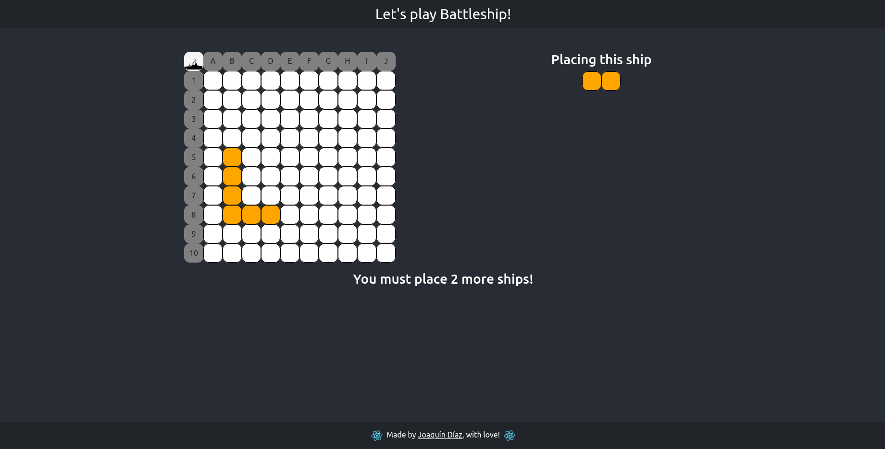

## The Game
you must place ships an then star to fire with clicks!
## How to run app
if you are using gitpod it will run automatically,
however, if you are in VScode locally,
(you must have node and npm on your machine)
first you must enter to the app folder:
### `cd battleship-with-react`
then you must install npm:
### `npm install`
and then run it:
### `npm start`
and the app will be available in your localhost:3000 server

if gitpod doesnt run the app automatically, try to follow the steps for local

if you have questions or commentaries, contact me: [joaquindiazalvarez@gmail.com](joaquindiazalvarez@gmail.com)
